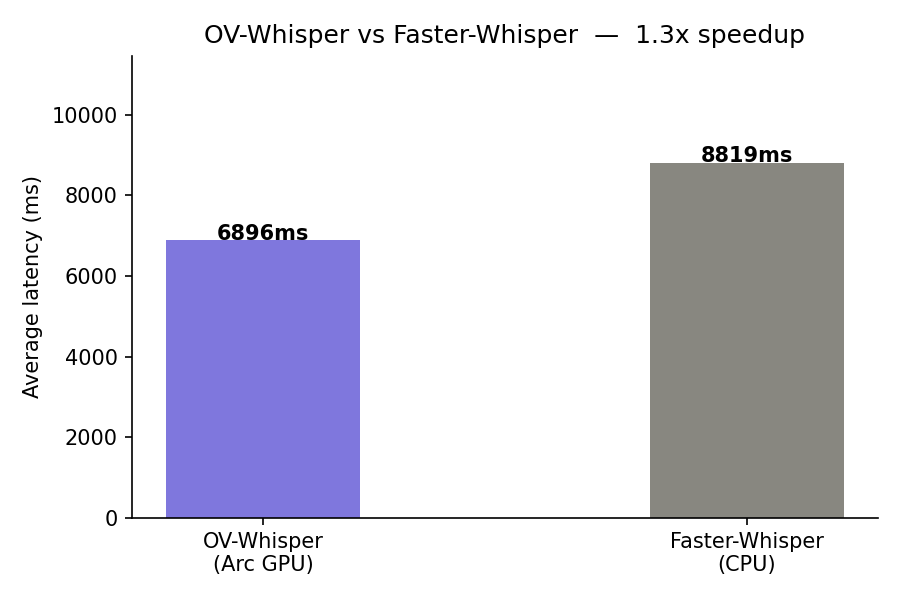

# OV-Whisper

A custom OpenAI Whisper inference engine built on Intel OpenVINO, designed to run on **Intel Arc GPUs** — hardware that faster-whisper and CTranslate2 do not support.

## Why this exists

[faster-whisper](https://github.com/guillaumekynast/faster-whisper) is the fastest Whisper implementation available — but it runs on CTranslate2 which has no Intel GPU support. If you have an Intel Arc GPU, you're stuck running on CPU.

This project builds a Whisper engine from scratch using OpenVINO, unlocking Intel Arc GPU acceleration for both batch transcription and real-time microphone transcription.

## Benchmark

**Hardware:** Intel Arc A750 GPU + Windows  
**Model:** whisper-small  
**Audio:** 25 seconds  
**Runs:** 5 (averaged)

| Engine | Backend | Avg Latency | RTF |
|---|---|---|---|
| **OV-Whisper** | Intel Arc GPU (OpenVINO) | **6896ms** | **0.28x** |
| Faster-Whisper | CPU (CTranslate2) | 8819ms | 0.35x |

> **1.3x faster** than faster-whisper — with encoder still running on CPU (FP16 overflow on GPU not yet resolved). Full GPU pipeline will push this further.



## Features

- Runs on Intel Arc GPU via OpenVINO
- Real-time microphone transcription with VAD
- Long-form audio transcription (any length)
- Automatic chunking with overlap merging
- Greedy decoding with stateful KV cache decoder
- Encoder on CPU + Decoder on GPU hybrid mode

## Project structure

```
ov-whisper/
├── ov_whisper/
│   ├── __init__.py
│   ├── audio.py          # mel spectrogram preprocessing
│   ├── engine.py         # OpenVINO encoder + decoder engine
│   ├── transcribe.py     # long-form transcription pipeline
│   └── realtime.py       # real-time mic transcription
├── scripts/
│   ├── benchmark.py      # OV-Whisper vs faster-whisper benchmark
│   ├── download_model.py # download pre-exported OV model from HuggingFace
├── main.py
└── pyproject.toml
```

## Setup

**Requirements:**
- Python 3.10
- Intel GPU with latest drivers from [intel.com](https://www.intel.com/content/www/us/en/download-center/home.html)
- Windows or Linux

**Install:**
```bash
git clone https://github.com/YOURUSERNAME/ov-whisper
cd ov-whisper
uv sync
```

**Download the model:**
```bash
python scripts/download_model.py
```

This downloads `OpenVINO/whisper-small-fp16-ov` from HuggingFace (~500MB).

## Usage

**Transcribe a file:**
```python
from ov_whisper.transcribe import transcribe_file

result = transcribe_file(
    audio_path = "audio/myfile.wav",
    model_dir  = model_dir,
    device     = "GPU"
)
print(result["text"])
```

**Real-time microphone transcription:**
```bash
python -m ov_whisper.realtime
```

**Run benchmark:**
```bash
python scripts/benchmark.py
```

## How it works

```
Audio file
    ↓
AudioPreprocessor     — resample to 16kHz, compute log-mel spectrogram [1, 80, 3000]
    ↓
Encoder (CPU/GPU)     — single forward pass → audio features [1, 1500, 768]
    ↓
Decoder loop (GPU)    — autoregressive, stateful KV cache, one token per step
    ↓
Tokenizer.decode()    — token ids → text
```

For audio longer than 30 seconds, the pipeline splits into overlapping chunks and merges results by detecting duplicated text in the overlap regions.

For real-time transcription, WebRTC VAD detects speech segments from the microphone stream and triggers transcription at natural pauses.

## Supported models

Any model from the `OpenVINO/` org on HuggingFace works:

| Model | HuggingFace ID |
|---|---|
| tiny | `OpenVINO/whisper-tiny-fp16-ov` |
| base | `OpenVINO/whisper-base-fp16-ov` |
| small | `OpenVINO/whisper-small-fp16-ov` |
| medium | `OpenVINO/whisper-medium-fp16-ov` |
| large-v3 | `OpenVINO/whisper-large-v3-fp16-ov` |

## Known limitations

- FP16 encoder overflows to NaN on Intel Arc GPU — encoder currently runs on CPU as workaround
- Beam search not yet implemented (greedy decoding only)

## Roadmap

- [ ] Fix FP16 encoder overflow on Arc GPU
- [ ] INT8 quantization for faster decoder
- [ ] Beam search decoding
- [ ] Word-level timestamps
- [ ] Streaming token output
- [ ] Python package release

## License

MIT
